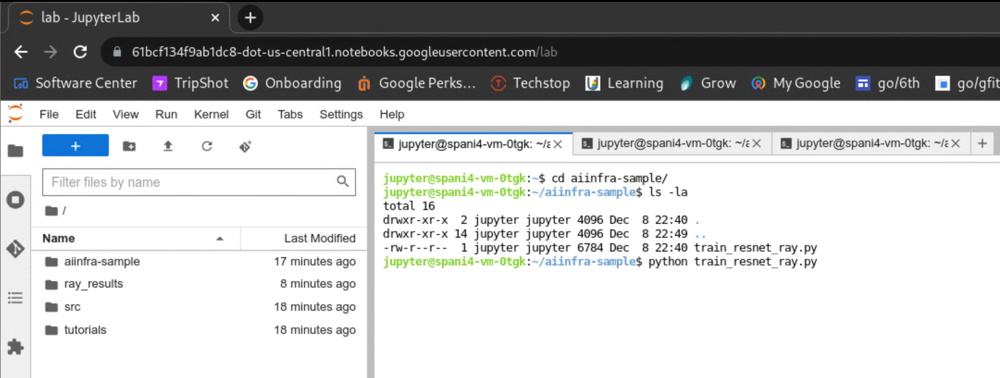

## Overview

The Cluster provisioning tool aims to provide a solution for the external users to provision a GPU cluster quickly and efficiently and run their AI/ML workload in minutes. Similarly it aims to provide an automated way of providing GPU clusters for the internal AI/ML pipeline. 
The cluster provisioning tool is a docker images which provision the cluster when run as a container. The docker image is self contained to create all the necessary resources for a GPU cluster. It has all the configs prepackaged and the tools installed. The configs packaged inside the image define the baseline GPU cluster. 

### Baseline cluster configuration

The baseline GPU cluster is the collection of resources recommended/supported by the AI accelerator experience team. Examples of that include Supported VM types, accelerator types, VM images, shared storage solutions like GCSFuse etc. These are first tested within the AI Accelerator experience team and then they are integrated with the cluster provisioning tool. The way they are incorporated into the tool is via Terraform configs packaged within the docker container. In some cases these features can be optional and users may choose to use it (eg: GCSFuse) but in some other cases they will be mandated by AI Accelerator exp. team (eg: DLVM image).  

The default GPU cluster that gets created by the cluster provisioning tool is a single instance VM of type “a2-highgpu-2g” with 2 “Nvidia-tesla-a100” GPUs attached to it. It uses pytorch-1-12-gpu-debian-10 image. There is no startup script or any orchestrator (like Ray) set up. The jupyter notebook endpoint is accessible for this VM instance. There is a GCS bucket created in the project provided by the user to manage the terraform state.  Users can create more advanced clusters using configuration described below.  

### Configuration for Users

Users have control to choose values for different fields for the resources. The mandatory parameters are:
1. **PROJECT_ID**: The project ID to use for resource creation. 
2. **NAME_PREFIX**: The name prefix to use for creating the resources. This is the unique ID for the clusters created using the provisioning tool. 
3. **ZONE**: The zone to use for resource creation.

The optional parameters are:
1. ***INSTANCE_COUNT***. This defines the VM instance count. The default value is 1 if not set.
2. ***GPU_COUNT***. This defines the GPU count per VM. The default value is 2 if not set.
3. ***VM_TYPE***. This defines the VM type. The default value is a2-highgpu-2g if not set.
4. ***ACCELERATOR_TYPE***. This defines the Accelerator type. The default value is nvidia-tesla-a100 if not set.
5. ***IMAGE_FAMILY_NAME***. This defines the image family name for the VM. The default value is pytorch-1-12-gpu-debian-10 if not set. We support images only from ml-images project.
6. ***IMAGE_NAME***. This defines the image name for the VM. The default value is c2-deeplearning-pytorch-1-12-cu113-v20221107-debian-10 if not set. We support images only from ml-images project.
7. ***DISK_SIZE_GB***. This defines the disk size in GB for the VMs. The default value is 2000 GB(2 TB) if not specified.
8. ***DISK_TYPE***. This defines the disk type to use for VM creation. The default value is pd-ssd if not defined.
9. ***TERRAFORM_GCS_PATH***. Google cloud storage bucket path to use for state management and copying scripts. If not provided then a default GCS bucket is created in the project. The name of the bucket is ‘aiinfra-terraform-<PROJECT_ID>’. For each deployment a separate folder is created under this GCS bucket in the name ‘<NAME_PREFIX-deployment>’. Ex: gs://test-bucket/deployment
10. ***VM_LOCALFILE_DEST_PATH***. This defines the destination directory path in the VM for file copy. If any local directory is mounted at "/usr/aiinfra/copy" in the docker container then all the files in that directory are copied to the VM_LOCALFILE_DEST_PATH in the VM. If not specified the default value is '/usr/aiinfra/copy'.
11. ***METADATA***. This defines optional metadata to be set for the VM. Ex: { key1 = "val", key2 = "val2"}
12. ***LABELS***. This defines key value pairs to set as labels when the VMs are created. Ex: { key1 = "val", key2 = "val2"} 
13. ***STARTUP_COMMAND***. This defines the startup command to run when the VM starts up. Ex: python /usr/cp/train.py
14. ***ORCHESTRATOR_TYPE***. This defines the Orchestrator type to be set up on the VMs. The currently supported orchestrator types are 
    -  __ray__: A Ray cluster is created using the MIG instances.
    -  __gke__: A private GKE cluster is created with private nodepool following the recommendations from the GKE team.
15. ***GKE_NODE_POOL_COUNT***: The number of homogeneous node pools for GKE cluster. Only applicable when `ORCHESTRATOR_TYPE` is `gke`.
16. ***GKE_MIN_NODE_COUNT***: The number of homogeneous node pools for GKE cluster. Only applicable when `ORCHESTRATOR_TYPE` is `gke`.
17. ***GKE_MAX_NODE_COUNT***:
18. ***GCS_MOUNT_LIST***. This defines the list of GCS buckets to mount. The format is `<bucket1>:</mount/path1>,<bucket2>:</mount/path2>`. For example: GCS_MOUNT_LIST=test-gcs-bucket-name:/usr/trainfiles
19. ***NFS_FILESHARE_LIST***. This defines the list of NFS file shares to mount. The format is `</mount/path1>:<NFS fileshare type>,</mount/path2>:<NFS fileshare type>:<NFS fileshare size in GB>`. For example: NFS_FILESHARE_LIST=/usr/nfsshare1:BASIC_SSD
    -  The `<NFS fileshare type>` cannot be empty. The supported values are `BASIC_HDD`,`BASIC_SSD`,`HIGH_SCALE_SSD` and `ENTERPRISE`.
    -  The `<NFS fileshare size in GB>` can be empty and the default value is 2560 GB (2.5 TB).
20. ***SHOW_PROXY_URL***. This controls if the Jupyter notebook proxy url is retrieved for the cluster or not. The default value is yes. If this is present and set to no, then connection information is not collected. The supported values are: yes, no.
21. ***MINIMIZE_TERRAFORM_LOGGING***. This controls the verbosity of terraform logs. When any value is set for this parameter, the terraform output is redirected to a local file and not printed on syserr. The log file is then uploaded to storage account. Any value can be set for this parameter, e.g.: yes, true.
22. ***NETWORK_CONFIG***. This controls the VPC type to be used for the MIG. The supported values are default_network, new_network and multi_nic_network. The dault value is default_network. The behaviour is 
    -  __default_network__: MIG uses the default VPC in the project.
    -  __new_network__: A new VPC is created for the MIG.
    -  __multi_nic_network__: New VPCs are created and used by all the VMs in the MIG. By default 5 new VPCs are created and 5 NICs are used for the MIG but that value is configurable.
23. ***DISABLE_OPS_AGENT***. Can be one of:
    - `false` (default): Install Ops Agent with random-backoff retries
    - `true`: Do not install Ops Agent


The user needs to provide value for the above mandatory parameters. All other parameters are optional and default behaviour is described above. Users can also enable/disable various features using feature flags in the config, for example: ORCHESTRATOR_TYPE, SHOW_PROXY_URL, GCSFuse, Multi-NIC VM etc. The configuration file contains configs as key value pairs and provided to the ‘docker run’ command. These are set as environment variables within the docker container and then entrypoint.sh script uses these environment variables to configure terraform to create resources accordingly. 

#### [Sample config file that the user provides](examples/env.list)

### Setting up Terraform to create resources

The user updates the config file and runs the docker image with the config file to create resources using the ‘docker run’ command. As part of the run command, users have to specify an action. The action can be Create, Destroy, Validate or Debug. The sample command looks like
```
docker run -it --env-file env.list us-docker.pkg.dev/gce-ai-infra/cluster-provision-dev/cluster-provision-image:latest Create

docker run -it --env-file env.list us-docker.pkg.dev/gce-ai-infra/cluster-provision-dev/cluster-provision-image:latest Destroy
```
All the setup needed before calling terraform to create resources is handled by entrypoint.sh script. This is packaged in the docker image and gets executed when the container starts. The entrypoint script validates environment variables and errors out if required ones are not provided. After that it uses the environment variables values to create the ‘tf.auto.tfvar’ file which is used by terraform to create the resources.

### User Authentication

The cluster provisioning tool interacts with GCP to create cloud resources on behalf of the user. So for doing that it needs the user’s authentication token with GCP. There are 3 environments where we expect the cluster provisioning tool to run. They are

1. Cloud shell: In the cloud shell environment, the default cloud authentication token is available that cluster provisioning tool uses for resource creation. No additional action is needed from the user. 
2. User machine with gcloud authentication: In the case where the user is running the cluster provisioning tool on their machine, they need to be authenticated with GCP for resource creation. There are 2 ways to do this.
   - Running ‘gcloud auth application-default login’ and mounting the local gcloud config to the container. For that use the  `docker run` command with option `-v ~/.config/gcloud:/root/.config/gcloud` for Linux or option `-v C:\Users%username%\AppData\Roaming\gcloud:/root/.config/gcloud` for windows.
   - Simply run the container image using ‘docker run’. When the cluster provisioning tool does not find any default authentication token it asks for manual authentication. Follow the prompt and provide the authorization code. The authorization prompt looks like below which is the same as gcloud authorization prompt.
    ```
    ================SETTING UP ENVIRONMENT FOR TERRAFORM================
    Setting Action to destroy
    Found Project ID test-project
    ERROR: (gcloud.projects.describe) You do not currently have an active account selected.
    Please run:
    
      $ gcloud auth login
    
    to obtain new credentials.
    
    If you have already logged in with a different account:
    
        $ gcloud config set account ACCOUNT
    
    to select an already authenticated account to use.
    Failed to get project number. Return value = 1
    No authenticated account found.
    Go to the following link in your browser:
    
        https://accounts.google.com/o/oauth2/auth?...........
    
    Enter authorization code: 4/0Afxxxxxxxxxxxx
    ```
3. LLM pipeline: LLM pipeline uses VMs to run the cluster provisioning tool and the VM has default cloud authentication token available. So additional authentication is not needed here.


### State management across sessions

When terraform is executed to create the resources, it creates state files to keep track of the created resources. While changing or destroying resources, terraform uses these statefiles. If these state files are created within the container, then they will be lost when the container exits. That will result in leaking of the resources. Having the state files in the container forces cleanup resources before the container exits. This ties the cluster lifespan to that of the container. So to have better control over the resources we need to have the state files managed in cloud storage. That way multiple runs of the container can use the same state files to manage the resources. 
Using the provisioning tool the user can provide a GCS bucket path that the entrypoint.sh script uses for managing the terraform state and sets it as the backend for terraform. If the user does not provide a GCS bucket path then the provisioning tool creates a GCS bucket for managing terraform state, but for this the user needs to have permission to create a GCS bucket in the project they are using.

### Copying AI/ML training script to the GPU cluster

There are 2 supported ways to copy training scripts to the GPU cluster. 
1. The first and preferred method is via GCSFuse. Users can simply provide their GCS bucket where they can store training scripts and data via the ‘GCS_MOUNT_LIST’ parameter. Cluster provisioning tool will mount the GCS bucket in the VM as a local volume using GCSFuse.
2. The second way is via copying scripts from the local directory. For that
   - First the user needs to mount a local directory containing training scripts to `"/usr/aiinfra/copy"` location. To do that use the ‘docker run’ command with option ‘-v /localdirpath:/usr/aiinfra/copy ’
   - Then the user needs to provide the destination location as `VM_LOCALFILE_DEST_PATH` parameter. All the files under the mounted local directory will be copied to all the VMs under the path provided. If `VM_LOCALFILE_DEST_PATH`  is not provided then the default destination path is `"/usr/aiinfra/copy"` in the VM.

### Multi-node training

For multi-node training, we need to set up an orchestrator on all the VMs of the GPU cluster. Users can choose the orchestrator via ‘ORCHESTRATOR_TYPE’ parameter. Currently we support only Ray as our orchestrator. We will be adding support for more orchestrator types like Slurm shortly.

### Shared Filesystem

For sharing data across machines running AI workload, users can use a shared file system. Currently we are using NFS filestore or GCS bucket as shared file system across machines. Users can use the `GCS_MOUNT_LIST` parameter to provide a comma separated list of GCS buckets and their mount paths. Similarly they can use `NFS_FILESHARE_LIST` parameter to provide comma separated list of paths. For each filestore path, a new filestore will be created and mounted to the path specified on every VM in the cluster.

### Connecting to the GPU cluster and running the training script

Jupyter notebook is the default and recommended way to connect to the GPU cluster. All the VMs that get created through the cluster provisioning tool have proxy enabled for jupyter notebook. As part of the DLVM image, jupyter notebook server is started when the VM is created and a proxy url is created to access the notebook endpoint. After successfully creating the VMs, the cluster provisioning tool waits for the jupyter notebook server to be up and provides the url to connect, which looks like below. 
```
Apply complete! Resources: 7 added, 0 changed, 0 destroyed.
Terraform apply finished successfully.
Jupyter notebook endpoint not available yet. Sleeping 15 seconds.
Jupyter notebook endpoint not available yet. Sleeping 15 seconds.
 Terraform state file location: 
gs://test-bucket/test-dir/terraform/state
 Use below links to connect to the VMs: 
test-vm-gh9l:https://1896669fce99a2c1-dot-us-central1.notebooks.googleusercontent.com
test-vm-nrcv:https://11a0dd452fdf76d3-dot-us-central1.notebooks.googleusercontent.com
```
The user can use this URL on their browser to connect to the jupyter notebook and execute their training script.
There are some default training scripts provided in the VMs under location `/home/jupyter/aiinfra-sample`. Users can run those scripts after connecting to the VM to see them in action. The example scripts use `Ray` for multi node trainings. So please use `ORCHESTRATOR_TYPE=Ray` while creating the cluster to run the script for multi-node training. 


### Resource cleanup

Since the resource state is stored outside of the container, the GPU cluster lifespan is decoupled from the container’s lifespan. Now the user can run the container and provide ‘Create’ as part of the ‘docker run’ command to create the resources. They can run the container again and provide ‘Destroy’ to destroy the container. The terraform state stored in the GCS bucket is cleared when the destroy operation is called.

## Instructions

1. gcloud auth application-default login.
2. gcloud auth configure-docker us-docker.pkg.dev
3. ***[`OPTIONAL - if project not set already`]*** gcloud config set account supercomputer-testing
4. Create env.list file. The sample env.list can be found [here](#sample-config-file-that-the-user-provides). 
5. ***[`SIMPLE CREATE`]*** 
   > docker run -it --env-file env.list us-docker.pkg.dev/gce-ai-infra/cluster-provision-dev/cluster-provision-image:latest Create
6. ***[`SIMPLE DESTROY`]*** 
   > docker run -it --env-file env.list us-docker.pkg.dev/gce-ai-infra/cluster-provision-dev/cluster-provision-image:latest Destroy
7. ***[`OPTIONAL - Pull docker image before hand`]*** 
   > docker pull us-docker.pkg.dev/gce-ai-infra/cluster-provision-dev/cluster-provision-image:latest
8. ***[`OPTIONAL - Mount local directory`]*** 
   > docker run -v /usr/username/test:/usr/aiinfra/copy -it --env-file env.list us-docker.pkg.dev/gce-ai-infra/cluster-provision-dev/cluster-provision-image:latest Create
9.  ***[`OPTIONAL - Mount gcloud config for auth token`]*** 
    > `Linux` docker run -v ~/.config/gcloud:/root/.config/gcloud -it --env-file env.list us-docker.pkg.dev/gce-ai-infra/cluster-provision-dev/cluster-provision-image:latest Create
    
    > `Windows` docker run -v C:\Users%username%\AppData\Roaming\gcloud:/root/.config/gcloud -it --env-file env.list us-docker.pkg.dev/gce-ai-infra/cluster-provision-dev/cluster-provision-image:latest Create
10. ***[`OPTIONAL - GCS bucket not provided`]*** 
    > Need storage object owner access if you don't already have a storage bucket to reuse.


## Billing Reports

You can view your billing reports for your HPC cluster on the
[Cloud Billing Reports](https://cloud.google.com/billing/docs/how-to/reports)
page. ​​To view the Cloud Billing reports for your Cloud Billing account,
including viewing the cost information for all of the Cloud projects that are
linked to the account, you need a role that includes the
`billing.accounts.getSpendingInformation` permission on your Cloud Billing
account.

To view the Cloud Billing reports for your Cloud Billing account:

1. In the Google Cloud Console, go to `Navigation Menu` >
   [`Billing`](https://console.cloud.google.com/billing/overview).
2. At the prompt, choose the Cloud Billing account for which you'd like to view
   reports. The Billing Overview page opens for the selected billing account.
3. In the Billing navigation menu, select `Reports`.

In the right side, expand the Filters view and then filter by label, specifying the key `aiinfra-cluster` and the desired value.

## Known Issues

1. ❗Error: Error waiting for Deleting Network: The network resource 'projects/xxx' is already being used by 'projects/firewall-yyy’.
   - This error is due to a known bug in VPC b/186792016.
2. ❗Error: Failed to get existing workspaces: querying Cloud Storage failed: Get "https://storage.googleapis.com/storage/v1/...": metadata: GCE metadata "instance/service-accounts/default/token?scopes=https%3A%2F%2Fwww.googleapis.com%2Fauth%2Fdevstorage.full_control" not defined
   - This error indicates that the user does not have storage object owner access in the project. Please get the storage object owner access or use `TERRAFORM_GCS_PATH=gs://<bucketname>/<foldername>` in the configuration.
3. ❗Error: Failed to get existing workspaces: querying Cloud Storage failed: googleapi: Error 403: username@google.com does not have serviceusage.services.use access to the Google Cloud project. Permission 'serviceusage.services.use' denied on resource (or it may not exist)., forbidden
   - This error indicates that the gcloud auth token provided as `-v ~/.config/gcloud:/root/.config/gcloud` or `-v C:\Users%username%\AppData\Roaming\gcloud:/root/.config/gcloud` has expired. Please renew the auth token by calling `gcloud auth application-default login` command or use without passing the auth token in docker run command like 
     > `docker run -it --env-file env.list us-docker.pkg.dev/gce-ai-infra/cluster-provision-dev/cluster-provision-image:latest Create`
